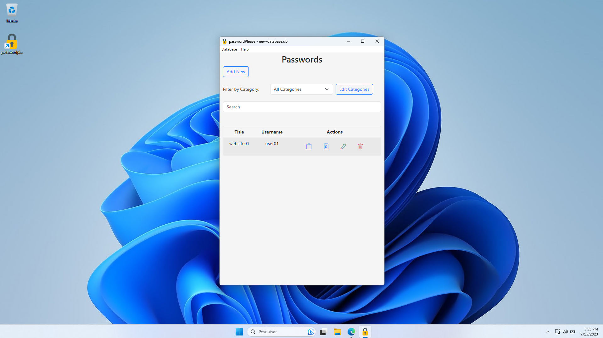

# passwordPlease

**A very simple ElectronJS app password manager.**

passwordPlease is a desktop application built with Electron.js that provides a secure and efficient way to store and manage your passwords.



More screenshots can be found [here](images/screenshots/).

This project is in its initial stages and is free to use. However, please be aware that it comes with no warranty. While every effort has been made to create a secure application, the author takes no responsibility for any consequences arising from its use.

It's also important to note that if you create a master password and forget it, the data encrypted by the program will not be recoverable. Please make sure to remember your master password!

## Features

- **Secure Password Storage**: passwordPlease uses advanced encryption techniques to ensure that your passwords are stored securely. All passwords are encrypted using AES-256-CBC encryption, bcrypt hashing, and are then stored in an SQLite3 database, providing an extra layer of security.

- **User-Friendly Interface**: The interface of passwordPlease is designed to be simple and user-friendly, making password management an easy task. You can add, delete, and update your passwords with a few simple clicks.

- **Accessible via Windows Taskbar**: To make accessing your passwords as convenient as possible, passwordPlease runs as a lightweight application in your Windows taskbar. This means your passwords are always just a couple of clicks away, without the need to open up a separate application or webpage.


**Application Structure**

- `package.json` - Points to the app's main file and lists its details and dependencies.
- `main.js` - Starts the app and creates a browser window to render HTML. This is the app's **main process**.
- `index.html` - A web page to render. This is the app's **renderer process**.
- `preload.js` - A content script that runs before the renderer process loads.

## To Use

To clone and run this repository you'll need [Git](https://git-scm.com) and [Node.js](https://nodejs.org/en/download/) (which comes with [npm](http://npmjs.com)) installed on your computer. From your command line:

```bash
# Clone this repository
git clone https://github.com/viniciusbuscacio/passwordPlease
# Go into the repository
cd passwordPlease
# Install dependencies
npm install
# Run the app
npm start
```
## Windows Installer

If you just want to install the application, you can download the Windows installer [here](https://github.com/viniciusbuscacio/passwordplease/releases/).

## Electron JS

As this project is based on the [Electron Quick Start](https://github.com/electron/electron-quick-start), you can use it as a reference.

You can learn more about each of these components in depth within the [Tutorial](https://electronjs.org/docs/latest/tutorial/tutorial-prerequisites).


## Encryption

This application uses a combination of encryption algorithms to keep user data secure.

1. **AES-256-CBC**: The Advanced Encryption Standard (AES) algorithm with a key size of 256 bits is used for encrypting and decrypting data. This is a symmetric encryption algorithm, meaning the same key is used for encrypting and decrypting the data. The app uses the Cipher Block Chaining (CBC) mode which provides good protection against many types of attack.

2. **Bcrypt**: Bcrypt is used to secure the user's master password. This involves using a "salt" that is randomly generated and then combined with the user's password to create a hash. The salt is stored alongside the password hash, and is used when verifying the user's password. Bcrypt is resistant to brute-force and rainbow table attacks.

3. **Mount Key**: The application uses a mount key, which is a cryptographic key used to encrypt and decrypt the user's data. This key is randomly created and is kept in memory while the user is authenticated.

4. **CryptoJS**: CryptoJS is a JavaScript library that offers cryptographic algorithms for use in JavaScript applications. In this case, CryptoJS is used to encrypt the mount key with the user's password. This allows the mount key to be securely stored.

5. **Testing**: The code includes tests to verify that the encryption and decryption works as expected. These tests check whether the mount key can be correctly encrypted and decrypted, and whether data can be correctly encrypted and decrypted.

6. **Data Storage**: All user data is stored in an SQLite3 database. However, before data is saved, it is first encrypted using the above-mentioned methods. This means that even if someone were to gain access to the SQLite3 database file, they would not be able to understand the data without the decryption key (mount key). This key is created and managed within the application and does not leave it, providing an additional layer of security. The decryption key is securely created and stored in memory while the user is authenticated, making it difficult for an attacker to retrieve it.


## Changelog

### 0.1.0

- Initial release.


## Credits

This application leans on several open-source libraries. We'd like to give our thanks to the following projects:

- [Electron](https://electronjs.org/): The backbone of the app, Electron lets us build cross-platform desktop apps with JavaScript, HTML, and CSS.
- [SQLite3](https://www.sqlite.org/index.html): SQLite3 provides the lightweight disk-based database that allows passwordPlease to store data persistently.
- [CryptoJS](https://cryptojs.gitbook.io/docs/): A collection of cryptographic algorithms implemented in JavaScript which we use for secure encryption and hashing processes.
- [bcrypt](https://www.npmjs.com/package/bcrypt): A library to help in hashing passwords. Bcrypt is a password-hashing function designed by Niels Provos and David Mazières.
- [bootstrap](https://www.getbootstrap.com/): CSS Framework used for styling the application.
- [bootstrap-icons](https://icons.getbootstrap.com/): For providing icon set.
- [uuid](https://www.npmjs.com/package/uuid): For the creation of RFC4122 UUIDs.
- [xss-filters](https://www.npmjs.com/package/xss-filters): An npm module providing XSS (cross-site scripting) string sanitation.

The full list of dependencies can be found in the package.json file. We greatly appreciate all the work that has been put into these projects.


## License

[CC0 1.0 (Public Domain)](LICENSE.md)
